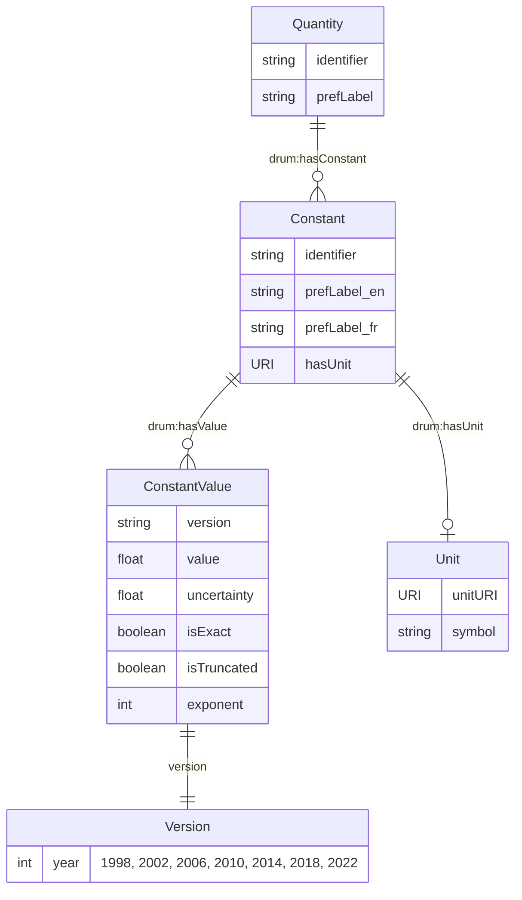
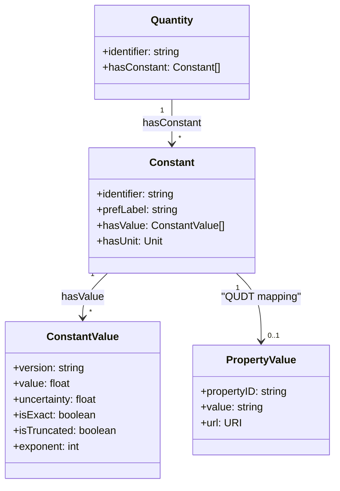

# CODATA Fundamental Physical Constants - Semantic Model

This document describes the semantic model for the CODATA fundamental physical constants dataset, represented in RDF Turtle format. The model captures physical quantities, constants, their values across different CODATA releases, and associated metadata.

## Model Overview

The CODATA semantic model organizes fundamental physical constants in a structured hierarchy with the following key concepts:

### Core Entities

1. **Quantity** (`drum:Quantity`) - Represents a physical quantity or measurable property (e.g., "electron mass", "speed of light")
2. **Constant** (`drum:Constant`) - Represents a specific physical constant with defined values across different time periods
3. **ConstantValue** (`drum:ConstantValue`) - Represents the measured/adopted value of a constant for a specific CODATA release year
4. **Units** - Physical units associated with constant values (kg, m/s, eV, etc.)

### Key Properties

- **`drum:hasConstant`** - Links a Quantity to its associated Constants
- **`drum:hasValue`** - Links a Constant to its ConstantValue instances across different years
- **`drum:hasUnit`** - Specifies the physical unit for a constant
- **`drum:value`** - The numerical value of a constant
- **`drum:uncertainty`** - The uncertainty/error in the measurement
- **`drum:isExact`** - Boolean indicating if the value is exactly defined (no uncertainty)
- **`drum:version`** - The CODATA release year (1998, 2002, 2006, 2010, 2014, 2018, 2022)

### Namespaces

- `drum:` - CODATA model namespace: `https://w3id.org/codata/fundamental/model/`
- `constant:` - Constants namespace: `https://w3id.org/codata/fundamental/constants/`
- `quantity:` - Quantities namespace: `https://w3id.org/codata/fundamental/quantities/`
- `schema:` - Schema.org vocabulary: `https://schema.org/`
- `skos:` - SKOS vocabulary: `http://www.w3.org/2004/02/skos/core#`

## Entity Relationship Diagram



## Class Hierarchy



## Sample SPARQL Queries

### 1. Find All Constants with Their Latest Values (2022)

```sparql
PREFIX drum: <https://w3id.org/codata/fundamental/model/>
PREFIX constant: <https://w3id.org/codata/fundamental/constants/>
PREFIX skos: <http://www.w3.org/2004/02/skos/core#>
PREFIX ns1: <https://w3id.org/codata/fundamental/model/ConstantValue#>

SELECT ?constant ?label ?value ?uncertainty ?unit ?isExact
WHERE {
    ?constant a drum:Constant ;
              skos:prefLabel ?label ;
              drum:hasValue ?constantValue .
    
    ?constantValue ns1:version "2022" ;
                   drum:value ?value ;
                   drum:isExact ?isExact .
    
    OPTIONAL { ?constantValue drum:uncertainty ?uncertainty }
    OPTIONAL { ?constant drum:hasUnit ?unit }
    
    FILTER(lang(?label) = "en")
}
ORDER BY ?label
```

### 2. Compare Planck Constant Values Across All CODATA Releases

```sparql
PREFIX drum: <https://w3id.org/codata/fundamental/model/>
PREFIX constant: <https://w3id.org/codata/fundamental/constants/>
PREFIX skos: <http://www.w3.org/2004/02/skos/core#>
PREFIX ns1: <https://w3id.org/codata/fundamental/model/ConstantValue#>

SELECT ?version ?value ?uncertainty
WHERE {
    constant:PlanckConstant drum:hasValue ?constantValue .
    
    ?constantValue ns1:version ?version ;
                   drum:value ?value .
    
    OPTIONAL { ?constantValue drum:uncertainty ?uncertainty }
}
ORDER BY ?version
```

### 3. Find All Electron-Related Constants

```sparql
PREFIX drum: <https://w3id.org/codata/fundamental/model/>
PREFIX quantity: <https://w3id.org/codata/fundamental/quantities/>
PREFIX constant: <https://w3id.org/codata/fundamental/constants/>
PREFIX skos: <http://www.w3.org/2004/02/skos/core#>
PREFIX schema: <https://schema.org/>

SELECT DISTINCT ?quantity ?constant ?label
WHERE {
    ?quantity a drum:Quantity ;
              schema:identifier ?quantityId ;
              drum:hasConstant ?constant .
    
    ?constant skos:prefLabel ?label .
    
    FILTER(CONTAINS(LCASE(?quantityId), "electron") || CONTAINS(LCASE(?label), "electron"))
    FILTER(lang(?label) = "en")
}
ORDER BY ?label
```

### 4. Find Constants with Exact Values (No Uncertainty)

```sparql
PREFIX drum: <https://w3id.org/codata/fundamental/model/>
PREFIX constant: <https://w3id.org/codata/fundamental/constants/>
PREFIX skos: <http://www.w3.org/2004/02/skos/core#>
PREFIX ns1: <https://w3id.org/codata/fundamental/model/ConstantValue#>

SELECT ?constant ?label ?value ?unit
WHERE {
    ?constant a drum:Constant ;
              skos:prefLabel ?label ;
              drum:hasValue ?constantValue .
    
    ?constantValue ns1:version "2022" ;
                   drum:value ?value ;
                   drum:isExact true .
    
    OPTIONAL { ?constant drum:hasUnit ?unit }
    
    FILTER(lang(?label) = "en")
}
ORDER BY ?label
```

### 5. Find Constants with Values in SI Base Units

```sparql
PREFIX drum: <https://w3id.org/codata/fundamental/model/>
PREFIX constant: <https://w3id.org/codata/fundamental/constants/>
PREFIX skos: <http://www.w3.org/2004/02/skos/core#>
PREFIX ns1: <https://w3id.org/codata/fundamental/model/ConstantValue#>

SELECT ?constant ?label ?value ?uncertainty ?unit
WHERE {
    ?constant a drum:Constant ;
              skos:prefLabel ?label ;
              drum:hasValue ?constantValue ;
              drum:hasUnit ?unit .
    
    ?constantValue ns1:version "2022" ;
                   drum:value ?value .
    
    OPTIONAL { ?constantValue drum:uncertainty ?uncertainty }
    
    FILTER(
        ?unit IN (
            <https://w3id.org/codata/fundamental/units/kg>,
            <https://w3id.org/codata/fundamental/units/m>,
            <https://w3id.org/codata/fundamental/units/s>,
            <https://w3id.org/codata/fundamental/units/A>,
            <https://w3id.org/codata/fundamental/units/K>,
            <https://w3id.org/codata/fundamental/units/mol>,
            <https://w3id.org/codata/fundamental/units/cd>
        )
    )
    
    FILTER(lang(?label) = "en")
}
ORDER BY ?unit ?label
```

### 6. Evolution of Measurement Precision Over Time

```sparql
PREFIX drum: <https://w3id.org/codata/fundamental/model/>
PREFIX constant: <https://w3id.org/codata/fundamental/constants/>
PREFIX skos: <http://www.w3.org/2004/02/skos/core#>
PREFIX ns1: <https://w3id.org/codata/fundamental/model/ConstantValue#>

SELECT ?constant ?label ?version ?value ?uncertainty ?relativeUncertainty
WHERE {
    ?constant a drum:Constant ;
              skos:prefLabel ?label ;
              drum:hasValue ?constantValue .
    
    ?constantValue ns1:version ?version ;
                   drum:value ?value ;
                   drum:uncertainty ?uncertainty .
    
    BIND((?uncertainty / ABS(?value)) AS ?relativeUncertainty)
    
    FILTER(lang(?label) = "en")
    FILTER(?relativeUncertainty > 0)
}
ORDER BY ?constant ?version
```

### 7. Find Constants Related to Fundamental Particles

```sparql
PREFIX drum: <https://w3id.org/codata/fundamental/model/>
PREFIX quantity: <https://w3id.org/codata/fundamental/quantities/>
PREFIX constant: <https://w3id.org/codata/fundamental/constants/>
PREFIX skos: <http://www.w3.org/2004/02/skos/core#>
PREFIX schema: <https://schema.org/>
PREFIX ns1: <https://w3id.org/codata/fundamental/model/ConstantValue#>

SELECT DISTINCT ?particle ?constant ?label ?value2022
WHERE {
    VALUES ?particle { "electron" "proton" "neutron" "muon" "tau" "alpha" }
    
    ?quantity a drum:Quantity ;
              schema:identifier ?quantityId ;
              drum:hasConstant ?constant .
    
    ?constant skos:prefLabel ?label ;
              drum:hasValue ?constantValue2022 .
    
    ?constantValue2022 ns1:version "2022" ;
                       drum:value ?value2022 .
    
    FILTER(CONTAINS(LCASE(?quantityId), ?particle) || CONTAINS(LCASE(?label), ?particle))
    FILTER(lang(?label) = "en")
}
ORDER BY ?particle ?label
```

## Usage Examples

The RDF dataset can be queried using SPARQL endpoints or loaded into triple stores like:

- **Apache Jena Fuseki**
- **Blazegraph**
- **Stardog**
- **GraphDB**

Example loading command (using Jena TDB):
```bash
tdbloader --loc=/path/to/tdb codata_constants.ttl
```

Example SPARQL endpoint query (using Fuseki):
```bash
curl -X POST http://localhost:3030/codata/sparql \
  -H "Content-Type: application/sparql-query" \
  -d "SELECT * WHERE { ?s ?p ?o } LIMIT 10"
```

## Data Sources

This semantic model is generated from the official CODATA fundamental physical constants datasets:
- NIST Fundamental Physical Constants: https://physics.nist.gov/cuu/Constants/
- CODATA 2018 adjustment: https://doi.org/10.1103/RevModPhys.93.025010
- CODATA 2022 values: Latest internationally recommended values

## License

This dataset follows the same licensing terms as the original CODATA/NIST data, which is in the public domain.
