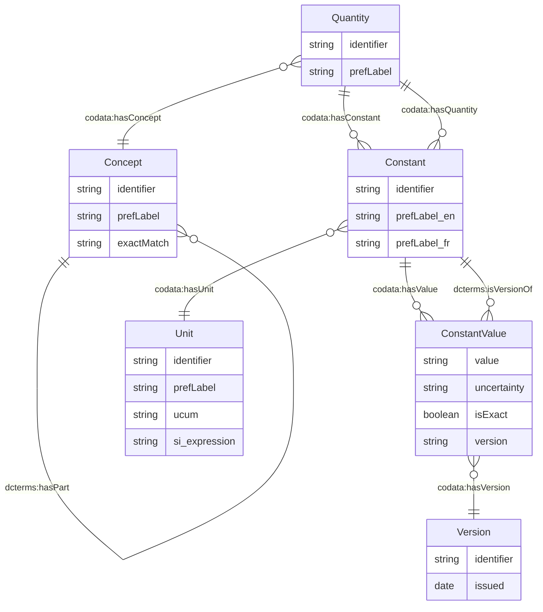
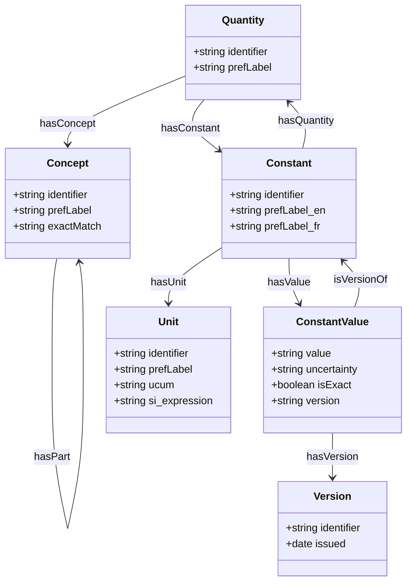

# CODATA Fundamental Physical Constants - Semantic Model

This document describes the semantic model for the CODATA fundamental physical constants dataset, represented in RDF Turtle format. The model captures physical quantities, constants, their values across different CODATA releases, associated metadata, and a rich conceptual taxonomy.

## Model Overview

The CODATA semantic model organizes fundamental physical constants in a structured hierarchy with the following key concepts:

### Core Entities

1. **Concept** (`skos:Concept`) - Taxonomic concepts that organize and categorize the domain knowledge (e.g., "SI Unit", "Elementary Particle", "Mass Ratio")
2. **Quantity** (`codata:Quantity`) - Represents a physical quantity or measurable property (e.g., "electron mass", "speed of light")  
3. **Constant** (`codata:Constant`) - Represents a specific physical constant with defined values across different time periods
4. **Unit** (`codata:Unit`) - Physical units of measurement (kg, m/s, eV, etc.)
5. **Version** (`codata:Version`) - CODATA release versions with publication dates (1998, 2002, 2006, 2010, 2014, 2018, 2022)
6. **ConstantValue** (`codata:ConstantValue`) - Represents the measured/adopted value of a constant for a specific CODATA release version

### Key Properties

- **`codata:hasConstant`** - Links a Quantity to its associated Constants
- **`codata:hasValue`** - Links a Constant to its ConstantValue instances across different years  
- **`codata:hasUnit`** - Specifies the physical unit for a constant
- **`codata:hasQuantity`** - Links a Constant to its parent Quantity
- **`codata:hasConcept`** - Links a Quantity to its conceptual classification
- **`codata:hasVersion`** - Links a ConstantValue to its CODATA Version
- **`codata:value`** - The numerical value of a constant
- **`codata:uncertainty`** - The uncertainty/error in the measurement
- **`codata:isExact`** - Boolean indicating if the value is exactly defined (no uncertainty)
- **`codata:version`** - The CODATA release year string (deprecated in favor of hasVersion)
- **`skos:broader`** - Hierarchical relationships in the concept taxonomy
- **`dcterms:hasPart`** - Part-whole relationships between concepts
- **`dcterms:isVersionOf`** - Links versioned constant values to their parent constant
- **`dcterms:issued`** - Publication date of a CODATA version
- **`schema:identifier`** - String identifiers for entities
- **`skos:prefLabel`** - Human-readable labels for entities

### Namespaces

- `codata:` - CODATA model namespace: `https://w3id.org/codata/fundamental/model/`
- `concept:` - Concepts namespace: `https://w3id.org/codata/fundamental/concepts/`
- `constant:` - Constants namespace: `https://w3id.org/codata/fundamental/constants/`
- `quantity:` - Quantities namespace: `https://w3id.org/codata/fundamental/quantities/`
- `unit:` - Units namespace: `https://w3id.org/codata/fundamental/units/`
- `version:` - Versions namespace: `https://w3id.org/codata/fundamental/versions/`
- `ucum:` - Units of Measure: `https://w3id.org/uom/`
- `si-unit:` - SI Digital Framework Units: `https://si-digital-framework.org/SI/units/`
- `wikidata:` - Wikidata entities: `https://www.wikidata.org/entity/`
- `schema:` - Schema.org vocabulary: `https://schema.org/`
- `skos:` - SKOS vocabulary: `http://www.w3.org/2004/02/skos/core#`
- `dcterms:` - Dublin Core Terms: `http://purl.org/dc/terms/`

## Entity Relationship Diagram


```mermaid
erDiagram
    Concept ||--o{ Concept : "skos:broader"
    Concept ||--o{ Concept : "dcterms:hasPart"
    Quantity }o--|| Concept : "codata:hasConcept"
    Quantity ||--o{ Constant : "codata:hasConstant"
    Constant }o--|| Quantity : "codata:hasQuantity"  
    Constant ||--o{ ConstantValue : "codata:hasValue"
    Constant }o--|| Unit : "codata:hasUnit"
    ConstantValue }o--|| Constant : "dcterms:isVersionOf"
    ConstantValue }o--|| Version : "codata:hasVersion"
    
    Concept {
        string identifier
        string prefLabel
        string exactMatch
    }
    
    Quantity {
        string identifier
        string prefLabel
    }
    
    Constant {
        string identifier
        string prefLabel_en
        string prefLabel_fr
    }
    
    Unit {
        string identifier
        string prefLabel
        string ucum
        string si_expression
    }
    
    Version {
        string identifier
        date issued
    }
    
    ConstantValue {
        string value
        string uncertainty
        boolean isExact
        string version
    }
```

## Class Hierarchy


```mermaid
classDiagram
    class Concept {
        +string identifier
        +string prefLabel
        +string exactMatch
    }
    
    class Quantity {
        +string identifier
        +string prefLabel
    }
    
    class Constant {
        +string identifier
        +string prefLabel_en
        +string prefLabel_fr
    }
    
    class Unit {
        +string identifier
        +string prefLabel
        +string ucum
        +string si_expression
    }
    
    class Version {
        +string identifier
        +date issued
    }
    
    class ConstantValue {
        +string value
        +string uncertainty
        +boolean isExact
        +string version
    }

    Concept --> Concept : broader
    Concept --> Concept : hasPart
    Quantity --> Concept : hasConcept
    Constant --> Quantity : hasQuantity
    Quantity --> Constant : hasConstant
    Constant --> Unit : hasUnit
    Constant --> ConstantValue : hasValue
    ConstantValue --> Constant : isVersionOf
    ConstantValue --> Version : hasVersion
```

## Conceptual Taxonomy

The model includes a rich conceptual taxonomy using SKOS concepts that organize domain knowledge:

### Major Concept Categories

1. **SI System Concepts**
   - `concept:SI` - International System of Units
   - `concept:SIBaseUnit` - SI base units
   - `concept:SIDerivedUnit` - SI derived units
   - `concept:SIDefiningConstant` - Constants that define the SI
   - `concept:SIDerivedConstant` - Constants derived from SI definitions

2. **Physical Particles**
   - `concept:ElementaryParticle` - Fundamental particles
   - `concept:AlphaParticle` - Alpha particles
   - `concept:Electron` - Electrons
   - `concept:Proton` - Protons
   - `concept:Neutron` - Neutrons

3. **Physical Properties**
   - `concept:Mass` - Mass properties
   - `concept:Charge` - Electric charge
   - `concept:Energy` - Energy properties
   - `concept:Length` - Length/distance
   - `concept:Time` - Time properties

4. **Relationships & Ratios**
   - `concept:Ratio` - General ratio concept
   - `concept:MassRatio` - Mass ratios between particles
   - `concept:ParticleMassRatio` - Specific particle mass ratios

### Example Concept Hierarchies

```turtle
concept:SIBaseUnit a skos:Concept ;
    skos:broader concept:SI ;
    skos:prefLabel "SI Base Unit" .

concept:ElementaryParticle a skos:Concept ;
    skos:broader concept:Particle ;
    skos:exactMatch wikidata:Q43116 ;
    skos:prefLabel "Elementary Particle" .

concept:AlphaParticleElectronMassRatio a skos:Concept ;
    dcterms:hasPart concept:AlphaParticle,
        concept:Electron,
        concept:MassRatio ;
    skos:prefLabel "Alpha Particle - Electron Mass Ratio" .
```

## Sample Data Structure

### Concept Example
```turtle
concept:ElementaryParticle a skos:Concept ;
    skos:broader concept:Particle ;
    skos:exactMatch wikidata:Q43116 ;
    skos:prefLabel "Elementary Particle" ;
    schema:identifier "ElementaryParticle" .
```

### Quantity Example
```turtle
quantity:ElectronMass a codata:Quantity ;
    codata:hasConcept concept:ElectronMass ;
    skos:prefLabel "Electron Mass" ;
    schema:identifier "ElectronMass" ;
    codata:hasConstant constant:ElectronMass .
```

### Constant Example
```turtle
constant:ElectronMass a codata:Constant ;
    codata:hasQuantity quantity:ElectronMass ;
    skos:prefLabel "Electron Mass",
        "Masse de l'électron"@fr ;
    schema:identifier "ElectronMass" ;
    codata:hasUnit unit:kg ;
    codata:hasValue <.../ElectronMass/2018>,
        <.../ElectronMass/2022> .
```

### Constant Value Example
```turtle
<https://w3id.org/codata/fundamental/constants/ElectronMass/2022> 
    a codata:ConstantValue ;
    dcterms:isVersionOf constant:ElectronMass ;
    codata:hasVersion version:2022 ;
    codata:isExact false ;
    codata:uncertainty "2.8e-40"^^xsd:string ;
    codata:value "9.1093837015e-31"^^xsd:string .
```

### Unit Example  
```turtle
unit:kg a codata:Unit ;
    skos:prefLabel "kilogram" ;
    schema:identifier "kg" ;
    ucum:ucum "kg" ;
    ucum:si_expression "kg" .
```

### Version Example
```turtle
version:2022 a codata:Version ;
    dcterms:issued "2024-05-09"^^xsd:date ;
    schema:identifier "2022" .
```

### Constant Value Example (Updated)
```turtle
<https://w3id.org/codata/fundamental/constants/ElectronMass/2022> 
    a codata:ConstantValue ;
    dcterms:isVersionOf constant:ElectronMass ;
    codata:hasVersion version:2022 ;
    codata:isExact false ;
    codata:uncertainty "2.8e-40"^^xsd:string ;
    codata:value "9.1093837015e-31"^^xsd:string .
```

## Sample SPARQL Queries

### 1. Find All Constants with Their Latest Values (2022)

```sparql
PREFIX codata: <https://w3id.org/codata/fundamental/model/>
PREFIX constant: <https://w3id.org/codata/fundamental/constants/>
PREFIX version: <https://w3id.org/codata/fundamental/versions/>
PREFIX skos: <http://www.w3.org/2004/02/skos/core#>
PREFIX dcterms: <http://purl.org/dc/terms/>

SELECT ?constant ?label ?value ?uncertainty ?unit ?isExact
WHERE {
    ?constant a codata:Constant ;
              skos:prefLabel ?label ;
              codata:hasValue ?constantValue .
    
    ?constantValue codata:hasVersion version:2022 ;
                   codata:value ?value ;
                   codata:isExact ?isExact ;
                   dcterms:isVersionOf ?constant .
    
    OPTIONAL { ?constantValue codata:uncertainty ?uncertainty }
    OPTIONAL { ?constant codata:hasUnit ?unit }
    
    FILTER(lang(?label) = "" || lang(?label) = "en")
}
ORDER BY ?label
```

### 2. Find All SI Defining Constants

```sparql
PREFIX codata: <https://w3id.org/codata/fundamental/model/>
PREFIX concept: <https://w3id.org/codata/fundamental/concepts/>
PREFIX skos: <http://www.w3.org/2004/02/skos/core#>

SELECT ?constant ?label ?concept_label
WHERE {
    ?constant a codata:Constant ;
              codata:hasQuantity ?quantity ;
              skos:prefLabel ?label .
    
    ?quantity codata:hasConcept ?concept .
    ?concept skos:broader* concept:SIDefiningConstant ;
             skos:prefLabel ?concept_label .
}
ORDER BY ?label
```

### 3. Find Particle Mass Ratios

```sparql
PREFIX codata: <https://w3id.org/codata/fundamental/model/>
PREFIX concept: <https://w3id.org/codata/fundamental/concepts/>
PREFIX quantity: <https://w3id.org/codata/fundamental/quantities/>
PREFIX version: <https://w3id.org/codata/fundamental/versions/>
PREFIX skos: <http://www.w3.org/2004/02/skos/core#>
PREFIX dcterms: <http://purl.org/dc/terms/>

SELECT ?quantity ?label ?latest_value
WHERE {
    ?quantity a codata:Quantity ;
              codata:hasConcept ?concept ;
              skos:prefLabel ?label ;
              codata:hasConstant ?constant .
    
    ?concept dcterms:hasPart concept:MassRatio .
    
    ?constant codata:hasValue ?value .
    ?value codata:hasVersion version:2022 ;
           codata:value ?latest_value .
}
ORDER BY ?label
```

### 4. Find Units and Their UCUM Codes

```sparql
PREFIX codata: <https://w3id.org/codata/fundamental/model/>
PREFIX unit: <https://w3id.org/codata/fundamental/units/>
PREFIX ucum: <https://w3id.org/uom/>
PREFIX skos: <http://www.w3.org/2004/02/skos/core#>
PREFIX schema: <https://schema.org/>

SELECT ?unit ?label ?ucum_code ?si_expression
WHERE {
    ?unit a codata:Unit ;
          skos:prefLabel ?label ;
          schema:identifier ?identifier .
    
    OPTIONAL { ?unit ucum:ucum ?ucum_code }
    OPTIONAL { ?unit ucum:si_expression ?si_expression }
}
ORDER BY ?label
```

### 5. Evolution of a Constant Over Time

```sparql
PREFIX codata: <https://w3id.org/codata/fundamental/model/>
PREFIX constant: <https://w3id.org/codata/fundamental/constants/>
PREFIX version: <https://w3id.org/codata/fundamental/versions/>
PREFIX dcterms: <http://purl.org/dc/terms/>
PREFIX skos: <http://www.w3.org/2004/02/skos/core#>
PREFIX schema: <https://schema.org/>

SELECT ?version_year ?issued_date ?value ?uncertainty
WHERE {
    constant:SpeedOfLightInVacuum codata:hasValue ?constantValue .
    
    ?constantValue dcterms:isVersionOf constant:SpeedOfLightInVacuum ;
                   codata:hasVersion ?version ;
                   codata:value ?value .
    
    ?version schema:identifier ?version_year ;
             dcterms:issued ?issued_date .
    
    OPTIONAL { ?constantValue codata:uncertainty ?uncertainty }
}
ORDER BY ?version_year
```

### 6. Find All Exact Constants (No Uncertainty)

```sparql
PREFIX codata: <https://w3id.org/codata/fundamental/model/>
PREFIX version: <https://w3id.org/codata/fundamental/versions/>
PREFIX skos: <http://www.w3.org/2004/02/skos/core#>

SELECT ?constant ?label
WHERE {
    ?constant a codata:Constant ;
              skos:prefLabel ?label ;
              codata:hasValue ?value .
    
    ?value codata:isExact true ;
           codata:hasVersion version:2022 .
}
ORDER BY ?label
```

### 7. Conceptual Hierarchy Navigation

```sparql
PREFIX concept: <https://w3id.org/codata/fundamental/concepts/>
PREFIX skos: <http://www.w3.org/2004/02/skos/core#>
PREFIX dcterms: <http://purl.org/dc/terms/>

SELECT ?broader_concept ?concept ?part
WHERE {
    ?concept skos:broader ?broader_concept ;
             skos:prefLabel ?concept_label .
    
    OPTIONAL { ?concept dcterms:hasPart ?part }
    
    ?broader_concept skos:prefLabel "SI Unit" .
}
```

### 8. CODATA Version Information

```sparql
PREFIX codata: <https://w3id.org/codata/fundamental/model/>
PREFIX version: <https://w3id.org/codata/fundamental/versions/>
PREFIX dcterms: <http://purl.org/dc/terms/>
PREFIX schema: <https://schema.org/>

SELECT ?version ?year ?issued_date ?constant_count
WHERE {
    ?version a codata:Version ;
             schema:identifier ?year ;
             dcterms:issued ?issued_date .
    
    {
        SELECT ?version (COUNT(DISTINCT ?constant_value) AS ?constant_count)
        WHERE {
            ?constant_value codata:hasVersion ?version .
        }
        GROUP BY ?version
    }
}
ORDER BY ?year
```

### 2. Compare Planck Constant Values Across All CODATA Releases

```sparql
PREFIX drum: <https://w3id.org/codata/fundamental/model/>
PREFIX constant: <https://w3id.org/codata/fundamental/constants/>
PREFIX skos: <http://www.w3.org/2004/02/skos/core#>
PREFIX ns1: <https://w3id.org/codata/fundamental/model/ConstantValue#>

SELECT ?version ?value ?uncertainty
WHERE {
    constant:PlanckConstant drum:hasValue ?constantValue .
    
    ?constantValue ns1:version ?version ;
                   drum:value ?value .
    
    OPTIONAL { ?constantValue drum:uncertainty ?uncertainty }
}
ORDER BY ?version
```

### 3. Find All Electron-Related Constants

```sparql
PREFIX drum: <https://w3id.org/codata/fundamental/model/>
PREFIX quantity: <https://w3id.org/codata/fundamental/quantities/>
PREFIX constant: <https://w3id.org/codata/fundamental/constants/>
PREFIX skos: <http://www.w3.org/2004/02/skos/core#>
PREFIX schema: <https://schema.org/>

SELECT DISTINCT ?quantity ?constant ?label
WHERE {
    ?quantity a drum:Quantity ;
              schema:identifier ?quantityId ;
              drum:hasConstant ?constant .
    
    ?constant skos:prefLabel ?label .
    
    FILTER(CONTAINS(LCASE(?quantityId), "electron") || CONTAINS(LCASE(?label), "electron"))
    FILTER(lang(?label) = "en")
}
ORDER BY ?label
```

### 4. Find Constants with Exact Values (No Uncertainty)

```sparql
PREFIX drum: <https://w3id.org/codata/fundamental/model/>
PREFIX constant: <https://w3id.org/codata/fundamental/constants/>
PREFIX skos: <http://www.w3.org/2004/02/skos/core#>
PREFIX ns1: <https://w3id.org/codata/fundamental/model/ConstantValue#>

SELECT ?constant ?label ?value ?unit
WHERE {
    ?constant a drum:Constant ;
              skos:prefLabel ?label ;
              drum:hasValue ?constantValue .
    
    ?constantValue ns1:version "2022" ;
                   drum:value ?value ;
                   drum:isExact true .
    
    OPTIONAL { ?constant drum:hasUnit ?unit }
    
    FILTER(lang(?label) = "en")
}
ORDER BY ?label
```

### 5. Find Constants with Values in SI Base Units

```sparql
PREFIX drum: <https://w3id.org/codata/fundamental/model/>
PREFIX constant: <https://w3id.org/codata/fundamental/constants/>
PREFIX skos: <http://www.w3.org/2004/02/skos/core#>
PREFIX ns1: <https://w3id.org/codata/fundamental/model/ConstantValue#>

SELECT ?constant ?label ?value ?uncertainty ?unit
WHERE {
    ?constant a drum:Constant ;
              skos:prefLabel ?label ;
              drum:hasValue ?constantValue ;
              drum:hasUnit ?unit .
    
    ?constantValue ns1:version "2022" ;
                   drum:value ?value .
    
    OPTIONAL { ?constantValue drum:uncertainty ?uncertainty }
    
    FILTER(
        ?unit IN (
            <https://w3id.org/codata/fundamental/units/kg>,
            <https://w3id.org/codata/fundamental/units/m>,
            <https://w3id.org/codata/fundamental/units/s>,
            <https://w3id.org/codata/fundamental/units/A>,
            <https://w3id.org/codata/fundamental/units/K>,
            <https://w3id.org/codata/fundamental/units/mol>,
            <https://w3id.org/codata/fundamental/units/cd>
        )
    )
    
    FILTER(lang(?label) = "en")
}
ORDER BY ?unit ?label
```

### 6. Evolution of Measurement Precision Over Time

```sparql
PREFIX drum: <https://w3id.org/codata/fundamental/model/>
PREFIX constant: <https://w3id.org/codata/fundamental/constants/>
PREFIX skos: <http://www.w3.org/2004/02/skos/core#>
PREFIX ns1: <https://w3id.org/codata/fundamental/model/ConstantValue#>

SELECT ?constant ?label ?version ?value ?uncertainty ?relativeUncertainty
WHERE {
    ?constant a drum:Constant ;
              skos:prefLabel ?label ;
              drum:hasValue ?constantValue .
    
    ?constantValue ns1:version ?version ;
                   drum:value ?value ;
                   drum:uncertainty ?uncertainty .
    
    BIND((?uncertainty / ABS(?value)) AS ?relativeUncertainty)
    
    FILTER(lang(?label) = "en")
    FILTER(?relativeUncertainty > 0)
}
ORDER BY ?constant ?version
```

### 7. Find Constants Related to Fundamental Particles

```sparql
PREFIX drum: <https://w3id.org/codata/fundamental/model/>
PREFIX quantity: <https://w3id.org/codata/fundamental/quantities/>
PREFIX constant: <https://w3id.org/codata/fundamental/constants/>
PREFIX skos: <http://www.w3.org/2004/02/skos/core#>
PREFIX schema: <https://schema.org/>
PREFIX ns1: <https://w3id.org/codata/fundamental/model/ConstantValue#>

SELECT DISTINCT ?particle ?constant ?label ?value2022
WHERE {
    VALUES ?particle { "electron" "proton" "neutron" "muon" "tau" "alpha" }
    
    ?quantity a drum:Quantity ;
              schema:identifier ?quantityId ;
              drum:hasConstant ?constant .
    
    ?constant skos:prefLabel ?label ;
              drum:hasValue ?constantValue2022 .
    
    ?constantValue2022 ns1:version "2022" ;
                       drum:value ?value2022 .
    
    FILTER(CONTAINS(LCASE(?quantityId), ?particle) || CONTAINS(LCASE(?label), ?particle))
    FILTER(lang(?label) = "en")
}
ORDER BY ?particle ?label
```

## Usage Examples

The RDF dataset can be queried using SPARQL endpoints or loaded into triple stores like:

- **Apache Jena Fuseki**
- **Blazegraph**
- **Stardog**
- **GraphDB**

Example loading command (using Jena TDB):
```bash
tdbloader --loc=/path/to/tdb codata_constants.ttl
```

Example SPARQL endpoint query (using Fuseki):
```bash
curl -X POST http://localhost:3030/codata/sparql \
  -H "Content-Type: application/sparql-query" \
  -d "SELECT * WHERE { ?s ?p ?o } LIMIT 10"
```

## Data Sources

This semantic model is generated from the official CODATA fundamental physical constants datasets:
- NIST Fundamental Physical Constants: https://physics.nist.gov/cuu/Constants/
- CODATA 2018 adjustment: https://doi.org/10.1103/RevModPhys.93.025010
- CODATA 2022 values: Latest internationally recommended values

## License

This dataset follows the same licensing terms as the original CODATA/NIST data, which is in the public domain.
